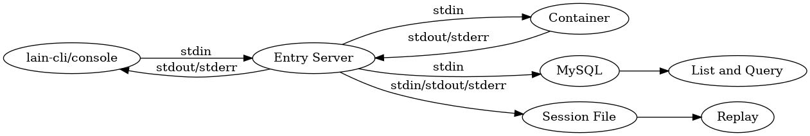
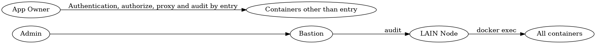
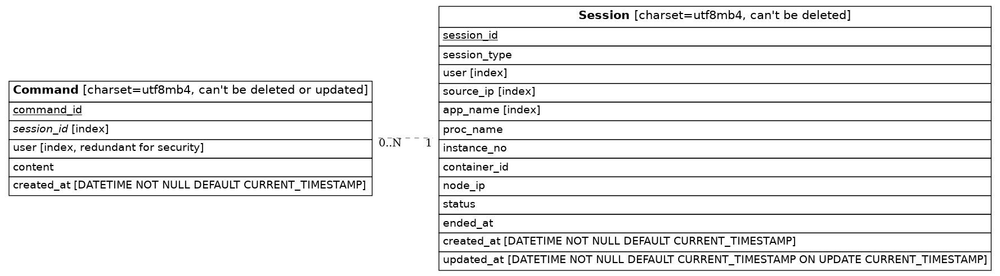

# Entry

[](https://travis-ci.org/laincloud/entry)
[](https://opensource.org/licenses/MIT)

## Documentation

相关文档见 [Entry 应用文档](https://laincloud.gitbooks.io/white-paper/content/outofbox/entry.html)

## 架构

### 整体架构

整体架构如下图所示：



- LAIN 应用所有者可以通过 `lain-cli` 或者 `console` 进入除 entry 之外的 LAIN 应用
- 系统管理员可以在 https://entry.${LAIN_DOMAIN}/web 搜索、回放用户会话或者搜索用户命令

### 审计

`Entry` 设计了完善的审计框架：

- `Entry` 审计所有经自己建立的用户会话
- 系统管理员还可以从 LAIN 节点进入所有的 LAIN 应用（包括 entry），这时由堡垒机负责审计

如下图所示：



### 数据库

`Entry` 将用户会话和命令存储于数据库，数据表如下图所示：



> - 请根据 [server/sql/bootstrap.sql](server/sql/bootstrap.sql) 创建表
> - 请根据 [server/sql/create_db_and_user.sql](server/sql/create_db_and_user.sql) 创建数据库和用户

## 部署

### 配置

请参考 [example.json](example.json) 编写配置文件，并上传到 lvault：

```
lain secret add ${LAIN-Domain} web /lain/app/prod.json -f example.json
```

> - `smtp.address` 需要包含端口，如：${mail-address}:25
> - `smtp.password` 可选，为空时不使用 auth

## 开发

- `server/gen` 下除 `server/gen/restapi/configure_entry.go` 外均由 [go-swagger](https://github.com/go-swagger/go-swagger) 生成，请不要手动修改
- `server/gen/restapi/configure_entry.go` 包含初始化逻辑以及后端 API 配置
- `server/handler` 包含后端 API 的实际逻辑

> 由 `swagger.yml` 生成代码：
>
> ```
> go get -u github.com/go-swagger/go-swagger/cmd/swagger  # 安装 swagger
> swagger generate server -f ./swagger.yml -t server/gen  # 生成代码
> ```

## Licensing

Entry is released under [MIT](https://github.com/laincloud/entry/blob/master/LICENSE) license.
